<div align="center">

# Solana Multiplayer Mini-Game Arcade

**20+ classic games, on-chain on Solana - play, wager, and climb the leaderboard**

[](https://solana.com)
[](https://nextjs.org)
[](https://www.typescriptlang.org)
[]()
[]()

*A Web3 arcade bundling 20+ classic multiplayer games on Solana - connect a wallet, match up, play, and compete.*

</div>

> **Available for development and custom work.** This is a working prototype / showcase. I can build and deliver the complete product - including the private production backend - or adapt it for your needs, under a development agreement (post-agreement fee). **Get in touch:** https://github.com/plinkdev1


---

## What Is This?

A multiplayer mini-game arcade on Solana. Players connect a wallet, get matched against others, play one of 20+ classic games, and climb global leaderboards - with on-chain matches, an NFT collection, and wallet-native play.

> **One wallet. 20+ games. On-chain matches and leaderboards.**

---

## Games

The proto wraps 20+ standard board and card games in a playful, sewer-themed **microcopy** layer - a deliberate branding experiment that gives familiar games a distinct identity. Each themed title is a well-known classic underneath:

| In-app title | Classic game |
|---|---|
| Poop Chess | Chess |
| Poop Checkers | Checkers |
| Poop Poker | Poker |
| Go Clog | Go |
| Infinite Poop Gomoku | Gomoku |
| Ludo Flush | Ludo |
| Uno Flush | Uno |
| Scrabble Shit | Scrabble |
| Backgammon Flush | Backgammon |
| Domino Clog | Dominoes |
| Rummy Clog | Rummy |
| Risk Clog | Risk |
| Poop Halma | Halma |
| Poop Mills | Nine Men's Morris |
| Poop Tac-Toe | Tic-Tac-Toe |
| Poop Boxes | Dots & Boxes |
| Battle Flush | Battleship |
| Peg Flush | Peg Solitaire |
| Ticket Flush | Ticket to Ride |
| Bubble Flush | Bubble Shooter |
---

## Features

| Feature | Description | Status |
|---|---|:---:|
| Game library | 20+ classic multiplayer games | ✅ |
| Multiplayer matches | Matchmaking and live play | ✅ |
| Wallet play | Phantom, Solflare, Ledger | ✅ |
| Leaderboards & stats | Global rankings and player stats | ✅ |
| On-chain matches | Anchor programs on Solana | 🚧 |
| Wagering | SPL-token stakes | 🚧 |
| NFT collection | Collectible avatars / items | 🚧 |
| Provable fairness | Switchboard VRF | 🚧 |

---

## How It Works

```
Wallet (Phantom / Solflare / Ledger)
        │
        ▼
Arcade lobby ──▶ match ──▶ game (20+ titles)
        │                       │
        ▼                       ▼
Leaderboards / stats     Anchor programs (matches · wagering)
        │
        ▼
Supabase (profiles · game history)
```

---

## Tech Stack

| Layer | Technology |
|-------|------------|
| Frontend | Next.js 16, React 19, TypeScript |
| Styling | Tailwind CSS, shadcn/ui |
| Chain | Solana - web3.js, Anchor programs, SPL token |
| Wallet | Solana Wallet Adapter (Phantom / Solflare / Ledger) |
| Data | Supabase |
| State | Zustand |

---

## Project Structure

```
solana-mini-game-arcade/
app/
   admin/
   api/
   backgammon-flush/
   battle-flush/
   bubble-flush/
   domino-clog/
components/
   admin/
   betting/
   escrow/
   feedback/
   games/
   nft/
hooks/
   use-mobile.ts
   use-toast.ts
   useGameData.ts
   useGameP2P.ts
   useGamePowerUps.ts
   useGameRealtime.ts
lib/
   admin/
   ai/
   anchor/
   config/
   constants/
   games/
nft-collection/
   metadata/
   candy-machine-config.json
programs/
   sewer-arena-escrow/
   sewer-arena-powerups/
public/
   docs/
   images/
   apple-icon.png
   golden-plunger-staff-neon.jpg
   icon-dark-32x32.png
   icon-light-32x32.png
scripts/
   01-create-tables.sql
   02-enable-realtime.sql
   03-create-rls-policies.sql
   04-create-triggers.sql
   05-create-powerup-events-table.sql
   06-verify-game-types.sql
styles/
   globals.css
types/
   betting-modal-props.ts
.gitignore
components.json
next.config.mjs
package.json
postcss.config.mjs
tsconfig.json
```

---

## Screenshots

<table>
<tr><td width="50%">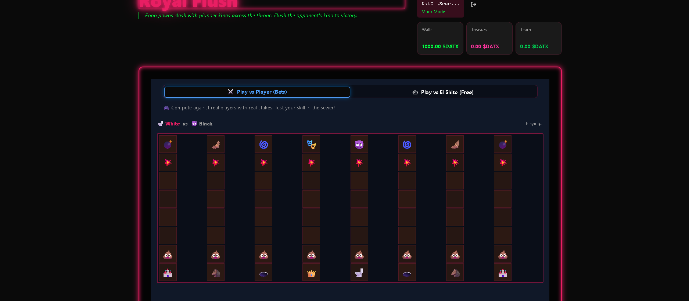</td><td width="50%">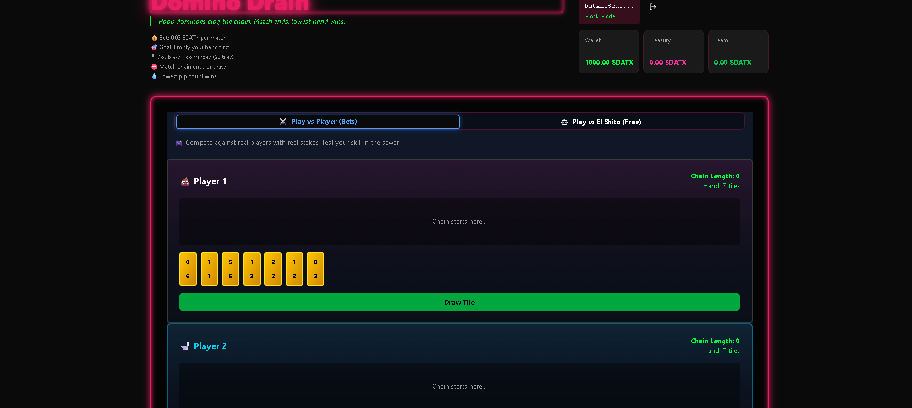</td></tr>
<tr><td width="50%">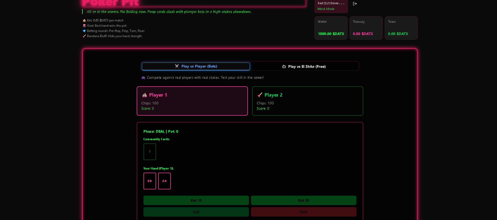</td><td width="50%">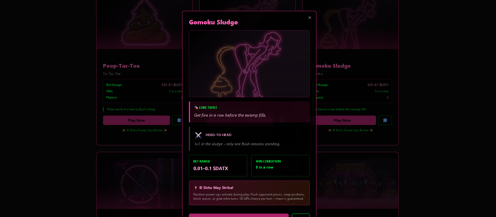</td></tr>
<tr><td width="50%">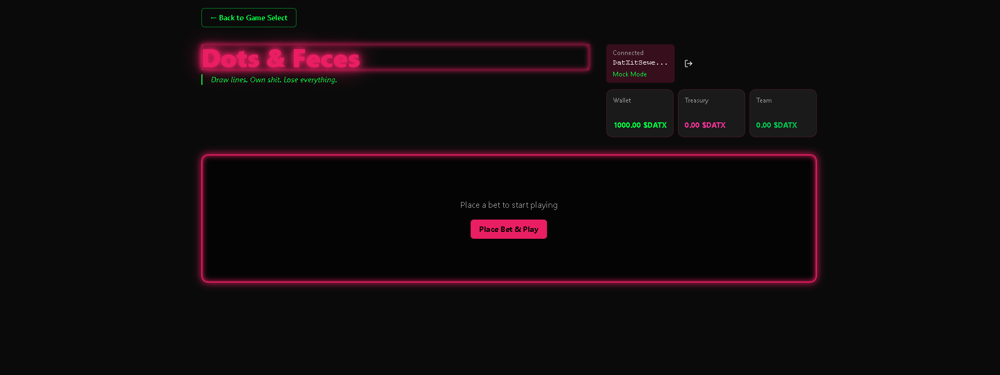</td><td width="50%">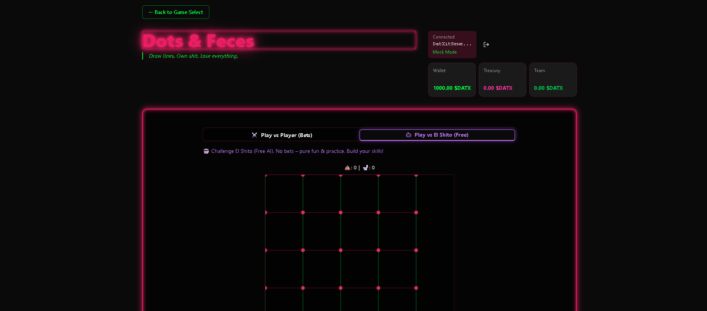</td></tr>
<tr><td width="50%">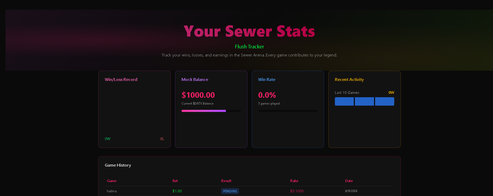</td><td width="50%">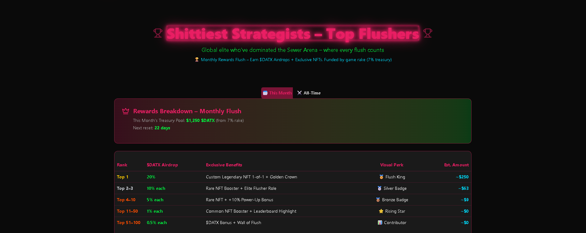</td></tr>
<tr><td width="50%">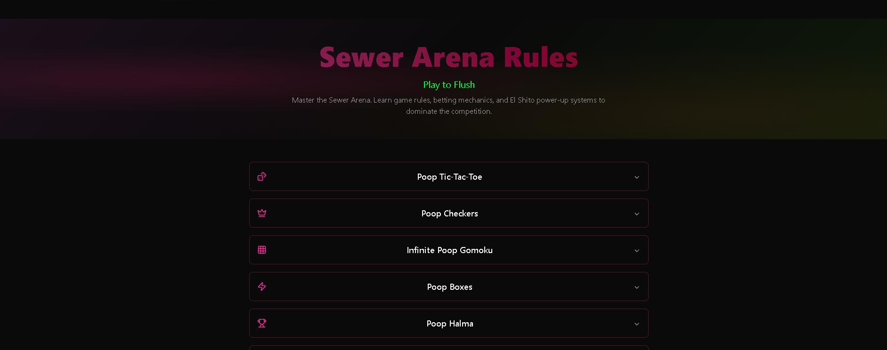</td><td width="50%">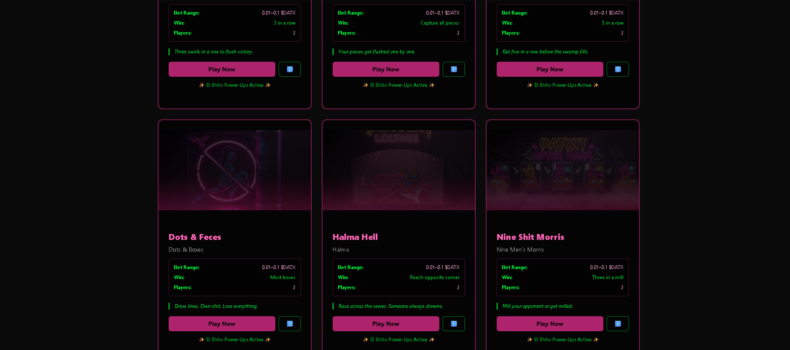</td></tr>
<tr><td width="50%">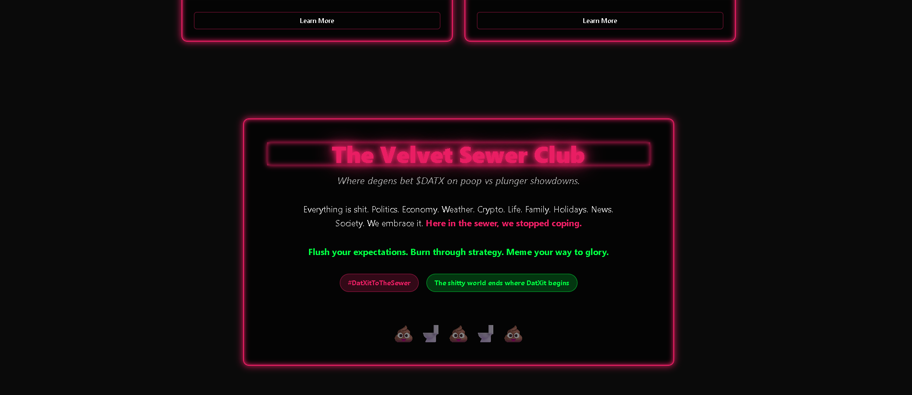</td><td width="50%">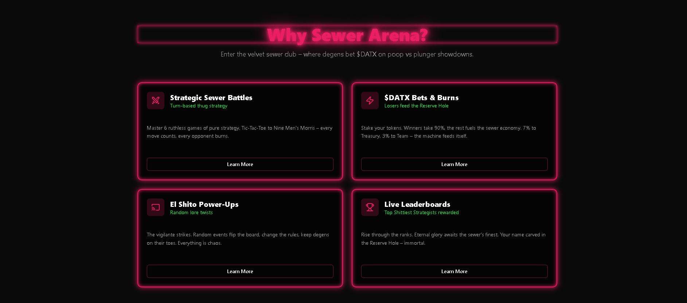</td></tr>
</table>

---

## Getting Started

```bash
npm install --legacy-peer-deps --ignore-scripts
npx next dev
```

Environment variables (names only - never commit real values):

```
NEXT_PUBLIC_SUPABASE_URL=
NEXT_PUBLIC_SUPABASE_ANON_KEY=
SUPABASE_SERVICE_ROLE_KEY=
NEXT_PUBLIC_SOLANA_RPC_URL=
```

---

## Roadmap

- On-chain match settlement and wagering on mainnet
- NFT collection mint
- Switchboard VRF provable fairness
- More games and tournaments

---

## Notes

Shared as a portfolio artifact demonstrating product and system design. Early prototype, not a finished product; games are for entertainment.

<div align="center">

Built on Solana · MIT

</div>
